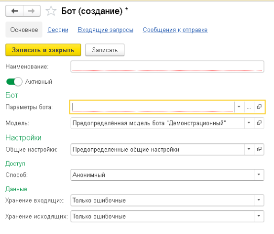
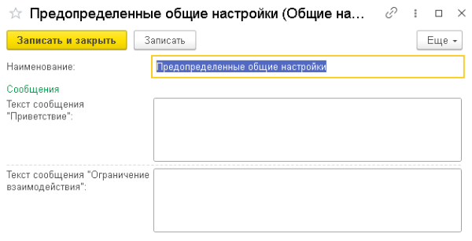
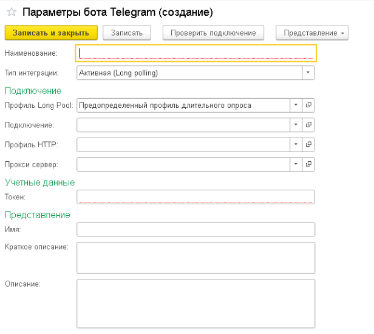

# Создание бота

Бот — рабочий экземпляр РИМ, который связывает модель бота с параметрами
интеграции мессенджера. В его карточке задаются модель бота, параметры
подключения, доступ и правила хранения данных.

## Основные параметры

Флаг **Активный** определяет, участвует ли бот в обработке входящих запросов.

Активный бот может получать входящие запросы и отправлять исходящие сообщения. Если флаг отключён, бот не обрабатывает входящие запросы и не выполняет отправку сообщений.

В поле **Модель** указывается экземпляр модели бота, который будет использоваться ботом.

Модель бота содержит прикладную логику обработки входящих запросов и событий. Она определяет, как бот должен реагировать и какие сообщения необходимо отправлять пользователю.

Каждый экземпляр модели бота может содержать собственный набор настроек. Например, для разных ботов можно использовать одну и ту же логику модели бота, но указать разные тексты приветствия или другие параметры поведения.

Подробнее о разработке и настройке моделей бота см. в разделе [Создание модели бота](create-model.md).

В поле **Общие настройки** указывается набор параметров, который может использоваться несколькими ботами.

Общие настройки хранятся в отдельном справочнике и позволяют не дублировать одинаковые значения в карточках разных ботов.

В них могут храниться стандартные тексты сообщений, ограничения взаимодействия и другие параметры, общие для нескольких ботов.

Использование общих настроек не является обязательным.

## Параметры интеграции

В поле **Параметры бота** указывается конфигурация подключения к конкретной интеграции мессенджера.

Параметры определяют интеграцию, способ получения входящих запросов и данные, необходимые для взаимодействия с сервисом мессенджера.

Параметры любой интеграции всегда содержат:

- поле **Тип интеграции**;
- группу **Подключение** с набором стандартных параметров подключения.

Поле **Тип интеграции** определяет способ получения входящих запросов.

Набор доступных значений зависит от возможностей конкретной интеграции. Например, могут поддерживаться следующие варианты:

- **Активная (Long polling)** — РИМ самостоятельно запрашивает новые события у сервиса мессенджера;
- **Пассивная (Webhook)** — сервис мессенджера отправляет события на HTTP-адрес РИМ.

Интеграция может поддерживать один или несколько способов подключения. Доступные варианты определяются её разработчиком.

Помимо обязательных полей, интеграция может добавлять собственные параметры конфигурации.

## Доступ и хранение

В группе **Доступ** указывается способ доступа к боту.

Способ доступа определяет, какие пользователи могут взаимодействовать с ботом и при каких условиях входящие запросы будут переданы модели бота для обработки.

Подробнее о доступных способах и настройке правил см. в разделе [Управление доступом](../integrations/access-control.md).

Поля **Хранение входящих** и **Хранение исходящих** определяют правила сохранения входящих запросов и исходящих сообщений в информационной базе.

Для входящих и исходящих данных режим хранения настраивается независимо.

В зависимости от выбранного режима можно сохранять все данные, только данные, при обработке которых возникли ошибки, либо полностью отключить их хранение.

Настройки хранения могут использоваться для диагностики работы бота, анализа ошибок и контроля объёма данных в информационной базе.

## Итог

После заполнения параметров и установки флага **Активный** бот сможет получать входящие запросы, передавать их выбранной модели бота для обработки и отправлять сформированные сообщения пользователям.
