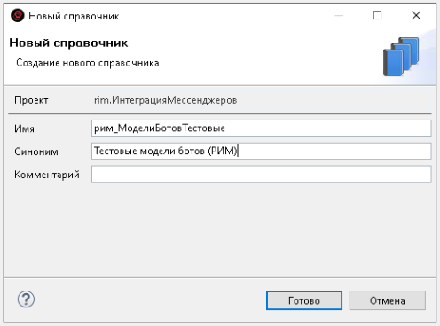
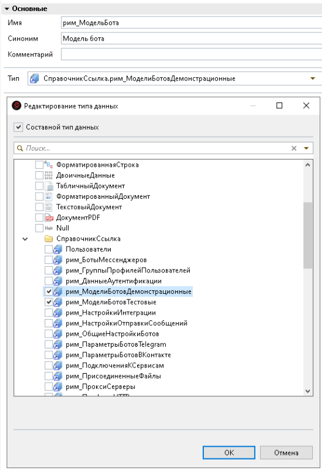
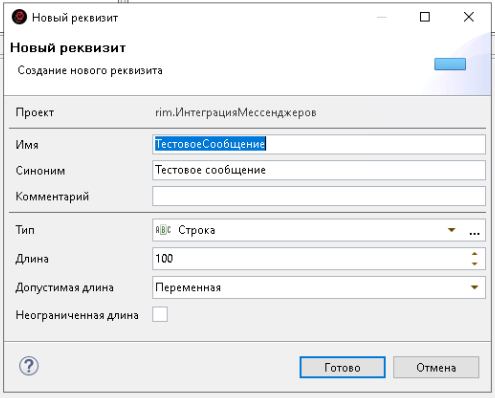
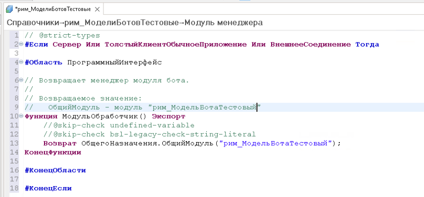
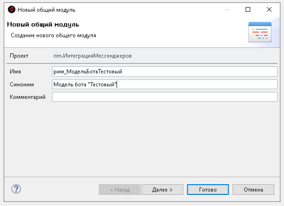
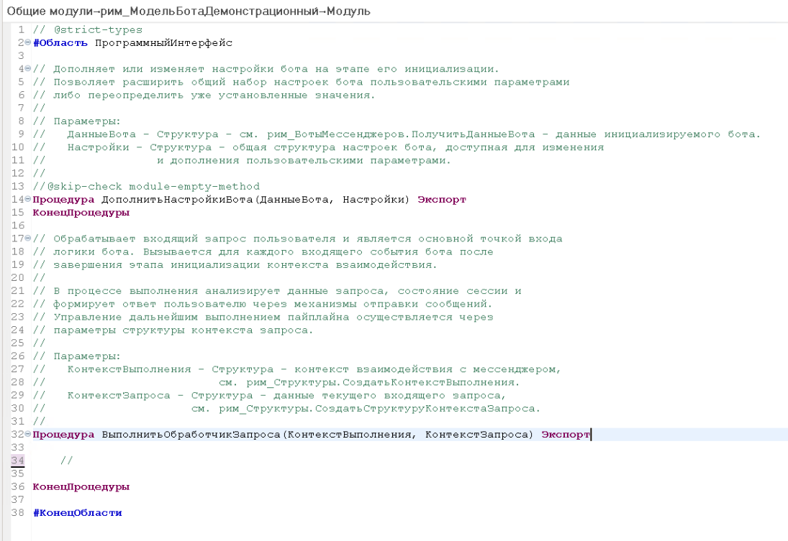

# 🧪 Создание модели бота

Модель бота содержит прикладную логику обработки сообщений и событий.

Именно модель определяет, как бот должен реагировать на действия пользователя: какие команды поддерживаются, какие данные используются при обработке запроса и какое сообщение необходимо отправить в ответ.

При этом модель не зависит от конкретного мессенджера. Одна и та же прикладная логика может использоваться ботами, подключёнными через разные интеграции.

В РИМ модель состоит из нескольких частей:

* справочника, в котором хранятся экземпляры модели и их настройки;
* общего модуля, содержащего прикладную логику обработки сообщений.

В этом разделе мы создадим простую тестовую модель. В ответ на любой входящий запрос она будет отправлять пользователю приветственное сообщение, указанное в настройках модели.

## 🗄️ Создание справочника

Для хранения экземпляров и настроек модели создадим отдельный справочник.

Каждый элемент этого справочника будет представлять отдельный экземпляр модели с собственным набором настроек.

Например, можно создать несколько элементов справочника и для каждого указать свой текст приветствия. При этом все элементы будут использовать одну и ту же прикладную логику модели.

Создайте новый справочник со следующими параметрами:

* **Имя:** `рим_МоделиБотовТестовые`
* **Синоним:** `Тестовые модели ботов (РИМ)`

[](../img/model/add-dictionary.png)

После этого в разделе **Определяемые типы** добавьте тип созданного справочника в состав определяемого типа `рим_МодельБота`.

[](../img/model/extend-type.png)

## ⚙️ Добавление настроек

Добавьте в созданный справочник реквизит:

```text
ТестовоеСообщение
```

[](../img/model/add-prop.png)

Значение реквизита `ТестовоеСообщение` будет использоваться как приветственный текст, который модель отправит пользователю.

## 🔗 Настройка модуля менеджера

Следующий шаг — подключить созданный справочник к механизму моделей РИМ.

Откройте модуль менеджера справочника и разместите в нём код подключения.

Аналогичный код можно скопировать из модуля менеджера справочника:

```text
рим_МоделиБотовДемонстрационные
```

[](../img/model/module-manager.png)

В коде укажите имя общего модуля, который будет содержать прикладную логику создаваемой модели:

```text
рим_МодельБотаТестовый
```

Указанное имя должно полностью совпадать с именем общего модуля, который будет создан на следующем шаге.

## 📄 Создание общего модуля

Создайте общий модуль со следующими параметрами:

* **Имя:** `рим_МодельБотаТестовый`
* **Синоним:** `Модель бота «Тестовый»`

[](../img/model/add-module.png)

Для общего модуля установите флаг **Сервер**.

Общий модуль будет содержать прикладную логику модели: обработку входящих сообщений, команд и других событий.

Код модуля можно скопировать из общего модуля:

```text
рим_МодельБотаДемонстрационный
```

[](../img/model/module-code.png)

## 💻 Реализация логики

Сначала необходимо добавить специфические настройки новой модели в общую структуру настроек бота. Это позволит в дальнейшем обращаться к их значениям при выполнении логики модели.

```text
Процедура ДополнитьНастройкиБота(ДанныеБота, Настройки) Экспорт

	Настройки.Вставить(
		"СообщениеПриветствия",
		ДанныеБота.Модель.ТестовоеСообщение);

КонецПроцедуры
```

`СообщениеПриветствия` — имя ключа, по которому значение настройки будет доступно в логике модели.

Затем в общем модуле необходимо реализовать реакцию на входящий запрос в методе `ВыполнитьОбработчикЗапроса`.

```text
Процедура ВыполнитьОбработчикЗапроса(
	КонтекстВыполнения,
	КонтекстЗапроса) Экспорт

	рим_ОтправкаСообщений.ОтправитьТекст(
		КонтекстВыполнения,
		КонтекстВыполнения.Бот.Настройки.СообщениеПриветствия);

КонецПроцедуры
```

В обработчике значение настройки `СообщениеПриветствия` извлекается из общей структуры настроек бота и отправляется пользователю в виде текстового сообщения.

## ✅ Результат

В результате создана тестовая модель, которая получает текст приветствия из настроек своего экземпляра и отправляет его пользователю в ответ на любой входящий запрос.