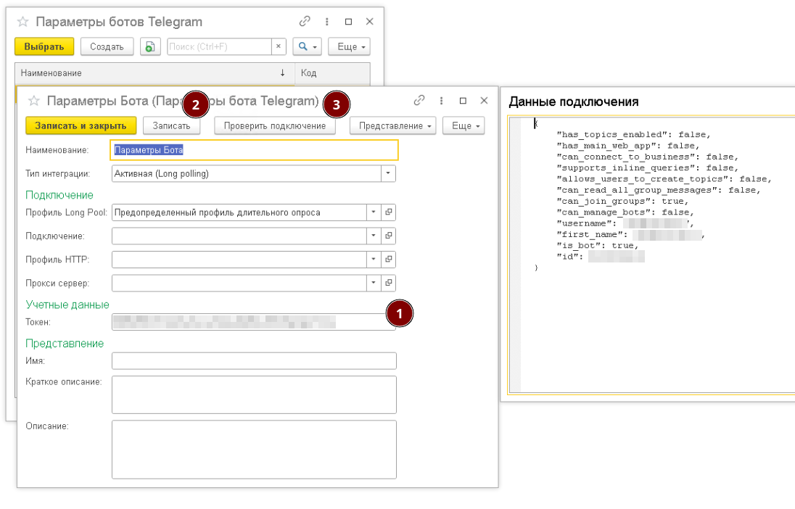

Инструкция позволяет выполнить базовую настройку РИМ и запустить демонстрационного Telegram-бота.

!!! tip "Что потребуется"

    Перед началом настройки убедитесь, что:

    - создан Telegram-бот через BotFather
    - получен токен Telegram-бота

### 📦 Установка

Установите расширение РИМ и предоставьте необходимые разрешения, как показано на скриншоте ниже.

[](img/extension-install.png)

---

### 🤖 Создание тестового бота

Бот — это основной компонент РИМ. Он принимает входящие события от мессенджеров и определяет, как система должна на них реагировать.

!!! info "Демонстрационный бот"
    РИМ не включает готовых ботов для промышленного использования, однако содержит демонстрационный бот, который можно использовать для проверки работы системы.

#### 1️⃣ Создание бота

Откройте справочник `Боты мессенджеров` в подсистеме `Интеграция мессенджеров`.

Создайте нового бота и заполните:

- **Наименование** — произвольное имя  
- **Модель** — выберите `Предопределенный бот (демонстрационный)`  
- **Параметры бота** — выберите тип данных `Параметры бота Telegram`

[](img/bot-create.png)

---

#### 2️⃣ Настройка параметров

Создайте параметры для нового бота.

Заполните:

- **Наименование** — произвольное имя
- **Токен** — токен бота Telegram

После заполнения сохраните изменения.

Для проверки корректности настроек используйте команду `Проверить подключение`.  
При успешном подключении отобразится окно с информацией о боте.

[](img/bot-params.png)

Созданные параметры укажите в поле **Параметры бота** при настройке бота.

---

#### 3️⃣ Проверка бота

После установки параметров выполните запись нового бота.

После записи в списке ботов в колонке **Состояние обработки** должно отображаться значение `Выполняется`.

[](img/bot-status.png)

Это означает, что бот готов к обработке входящих сообщений и отправке ответов.

После успешного запуска бота начните чат с Telegram-ботом и отправьте любое сообщение.

[](img/telegram-bot-response.png)

!!! success "Проверка выполнена успешно"

    При корректной настройке бот должен ответить сообщением:

    ```text
    Hello World
    ```