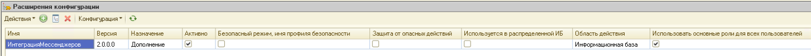

# Установка расширения

Установите расширение РИМ и подтвердите предоставление необходимых разрешений, как показано на скриншоте ниже.

После установки расширения можно проверить работоспособность РИМ, настроив демонстрационного бота для [Telegram](telegram.md) или [ВКонтакте](vk.md).
