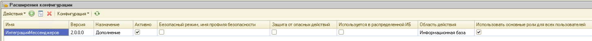
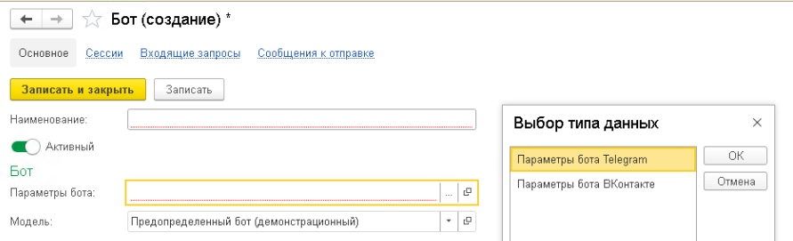
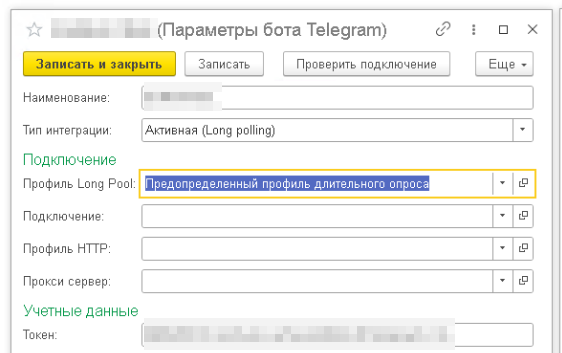
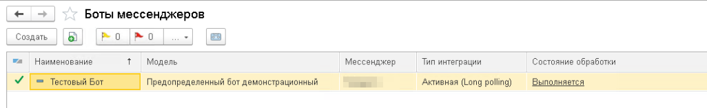
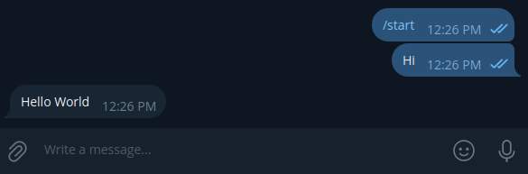

# 🚀 Быстрый старт

Инструкция позволяет выполнить базовую настройку РИМ и запустить демонстрационного Telegram-бота.

!!! info "Совместимость"

    Руководство актуально для версии РИМ `2.0.0.0`.

!!! tip "Что потребуется"

    Перед началом настройки:

    - Установите расширение РИМ
    - Подготовьте учетные данные платформы мессенджера

    Информация о получении учетных данных
    приведена в соответствующих разделах документации.

---

## 📦 Установка

Установите расширение РИМ и предоставьте необходимые разрешения, как показано на скриншоте ниже.

---

## 🤖 Создание тестового бота

Бот — это основной компонент РИМ. Он принимает входящие события от мессенджеров и определяет, как система должна на них реагировать.

!!! info "Демонстрационный бот"

    РИМ не включает готовых ботов для промышленного использования, однако содержит демонстрационный бот, который можно использовать для проверки работы системы.

### 1️⃣ Создание бота

Откройте справочник `Боты мессенджеров` в подсистеме `Интеграция мессенджеров`.

Создайте нового бота и заполните:

- **Наименование** — произвольное имя
- **Параметры бота** — выберите параметры `Telegram`
- **Модель** — выберите `Предопределенный бот (демонстрационный)`

---

### 2️⃣ Настройка параметров

Создайте параметры для нового бота.

Заполните:

- **Наименование** — произвольное имя
- **Токен** — токен Telegram-бота, полученный через [BotFather](https://telegram.me/BotFather)

После заполнения сохраните изменения.

Для проверки корректности настроек выполните команду `Проверить подключение`.

При успешном подключении отобразится окно с информацией о боте.

Созданные параметры укажите в поле **Параметры бота** при настройке бота.

---

### 3️⃣ Проверка бота

После установки параметров выполните запись нового бота.

После записи в списке ботов в колонке **Состояние обработки** должно отображаться значение `Выполняется`.

Это означает, что бот готов к обработке входящих сообщений и отправке ответов.

После откройте Telegram, начните новый чат с ботом и отправьте любое сообщение.

!!! success "Проверка подключения выполнена"

    