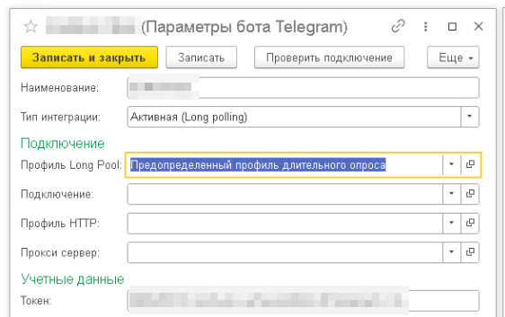
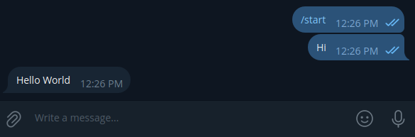

# Проверка бота Telegram

Инструкция описывает настройку и запуск демонстрационного Telegram-бота в РИМ.

!!! tip "Что потребуется"

    Для настройки потребуются:

    - Telegram-бот, созданный с помощью [BotFather](https://telegram.me/BotFather);
    - токен Telegram-бота.

---

## Создание демонстрационного бота

Бот связывает демонстрационную модель бота с параметрами интеграции Telegram и создаёт работающий экземпляр для обработки входящих запросов.

!!! info "Демонстрационный бот"

    РИМ не включает готовых ботов для промышленного использования, однако содержит демонстрационную модель бота, которую можно использовать для проверки работы системы.

### 1. Создание бота

Откройте справочник `Боты мессенджеров` в подсистеме `Интеграция мессенджеров`.

Начните создание нового бота и заполните:

- **Наименование** — произвольное имя;
- **Модель** — выберите `Предопределённый бот (демонстрационный)`;
- **Параметры бота** — создайте новый элемент с параметрами интеграции Telegram;
- **Активный** — установите флаг.

---

### 2. Настройка параметров

Создайте параметры для нового бота.

Заполните:

- **Наименование** — произвольное имя;
- **Токен** — токен Telegram-бота, полученный через [BotFather](https://telegram.me/BotFather).

!!! warning "Безопасность токена"

    Не публикуйте токен бота и не передавайте его третьим лицам.

После заполнения сохраните изменения.

Для проверки корректности настроек выполните команду `Проверить подключение`.

При успешном подключении отобразится окно с информацией о боте.

Созданные параметры укажите в поле **Параметры бота** при настройке бота.

---

### 3. Проверка бота

После выбора параметров запишите нового бота.

После записи дождитесь запуска обработки. В колонке **Состояние обработки** должно отобразиться значение `Выполняется`.

Это означает, что бот готов к обработке входящих запросов и отправке ответов.

Затем откройте Telegram, начните чат с ботом и отправьте любое сообщение.

!!! success "Проверка работы бота выполнена"

    
