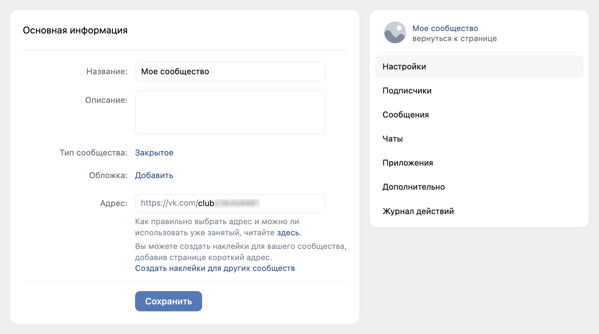
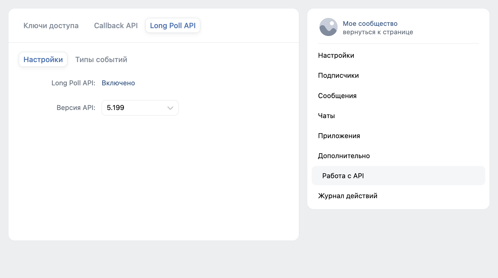
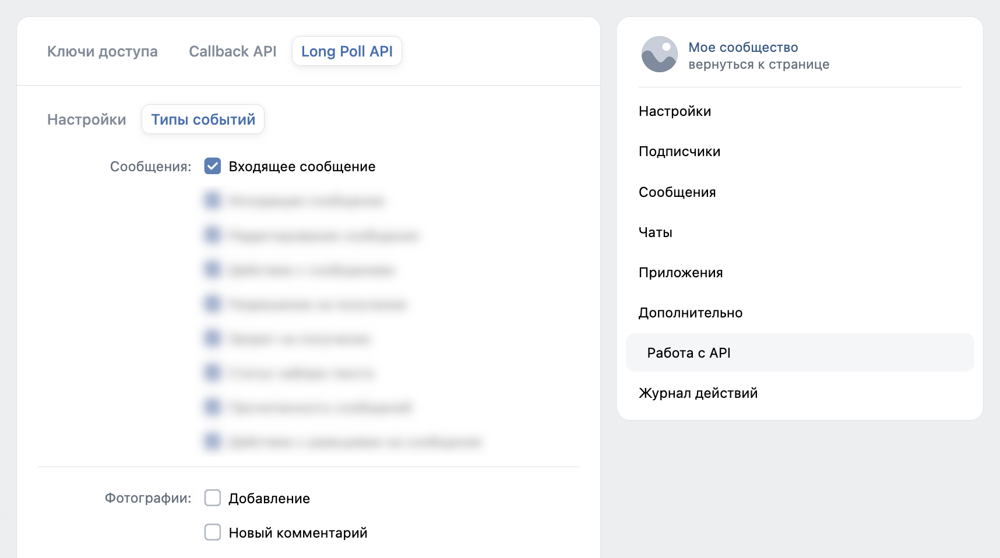
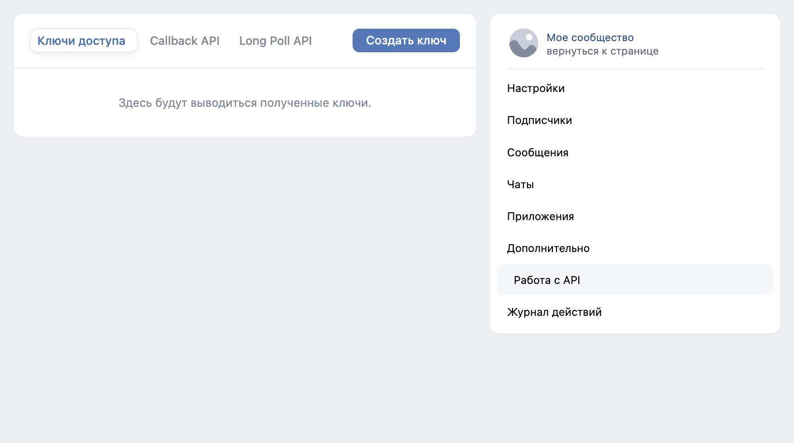
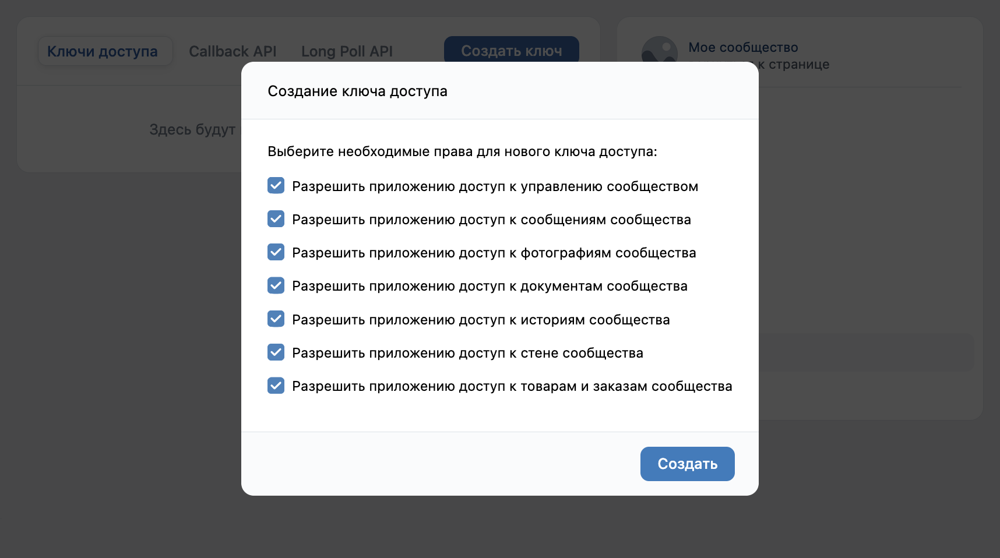

# Подготовка сообщества ВКонтакте

Для подключения сообщества ВКонтакте к РИМ необходимо получить идентификатор сообщества, включить Long Poll API и создать ключ доступа.

На этой странице описаны только настройки, необходимые для работы демонстрационного бота.

## Идентификатор сообщества

Откройте настройки созданного сообщества.

Скопируйте числовую часть адреса сообщества после `club`.

Например: `https://vk.com/club123456789` → `123456789`.

Полученное значение потребуется при настройке параметров интеграции ВКонтакте в РИМ.

---

## Настройка Long Poll API

На странице **Работа с API** перейдите в раздел **Long Poll API**.

Включите использование Long Poll API, затем откройте настройки типов событий.

Для работы демонстрационного бота достаточно включить получение входящих запросов.

---

## Ключ доступа

После настройки Long Poll API перейдите на вкладку **Ключи доступа**.

Создайте новый ключ доступа.

И предоставьте ему необходимые разрешения, как показано на скриншоте ниже.

Скопируйте созданный ключ доступа: он потребуется при настройке параметров бота в РИМ.

!!! warning "Безопасность ключа"

    Не публикуйте ключ доступа и не передавайте его третьим лицам.

---

После завершения настройки у вас должны быть:

- идентификатор сообщества;
- ключ доступа сообщества.

Эти данные используются при создании параметров интеграции ВКонтакте в РИМ.

Далее настройте [демонстрационного бота ВКонтакте](vk.md).
