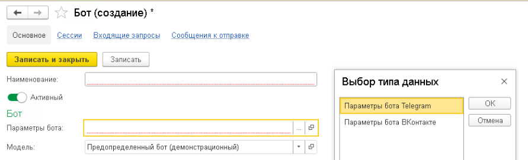
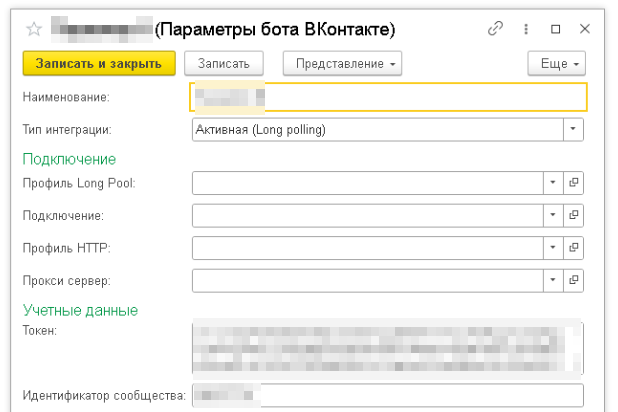
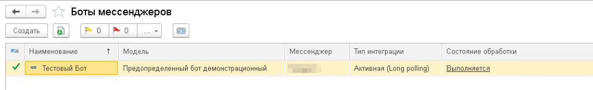
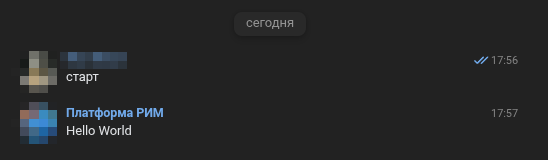

# 🚀 Проверка бота ВКонтакте

Инструкция описывает настройку и запуск демонстрационного ВКонтакте-бота в РИМ.

!!! tip "Что потребуется"

    Для настройки потребуются:

    - сообщество ВКонтакте с включёнными сообщениями;
    - ключ доступа сообщества;
    - идентификатор сообщества.

    Порядок создания и настройки сообщества, а также получения данных для подключения описан в разделе
    [Подготовка сообщества](vk-community.md).

---

## 🤖 Создание демонстрационного бота

Бот связывает демонстрационную модель с параметрами интеграции ВКонтакте и создаёт работающий экземпляр для обработки входящих сообщений.

!!! info "Демонстрационный бот"

    РИМ не включает готовых ботов для промышленного использования, однако содержит демонстрационную модель, которую можно использовать для проверки работы системы.

### 1️⃣ Создание бота

Откройте справочник `Боты мессенджеров` в подсистеме `Интеграция мессенджеров`.

Создайте нового бота и заполните:

- **Наименование** — произвольное имя;
- **Модель** — выберите `Предопределённый бот (демонстрационный)`;
- **Параметры бота** — создайте новый элемент с параметрами интеграции ВКонтакте.

[](../img/bot-create.png)

---

### 2️⃣ Настройка параметров

Создайте параметры для нового бота.

Заполните:

- **Наименование** — произвольное имя
- **Токен** — ключ доступа сообщества ВКонтакте
- **Идентификатор сообщества** — идентификатор (ID) сообщества ВКонтакте

После заполнения сохраните изменения.

[](../img/vk-params.png)

Созданные параметры укажите в поле **Параметры бота** при настройке бота.

---

### 3️⃣ Проверка бота

После выбора параметров запишите нового бота.

После записи в списке ботов в колонке **Состояние обработки** должно отображаться значение `Выполняется`.

[](../img/bot-status.png)

Это означает, что бот готов к обработке входящих сообщений и отправке ответов.

Откройте сообщество ВКонтакте, начните диалог с ботом и отправьте сообщение:

```text
старт
```

или

```text
/start
```

!!! success "Проверка работы бота выполнена"

    